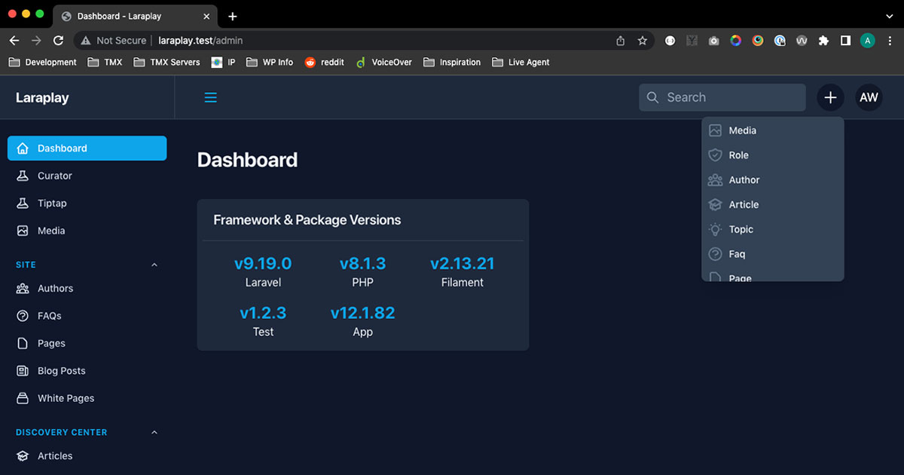
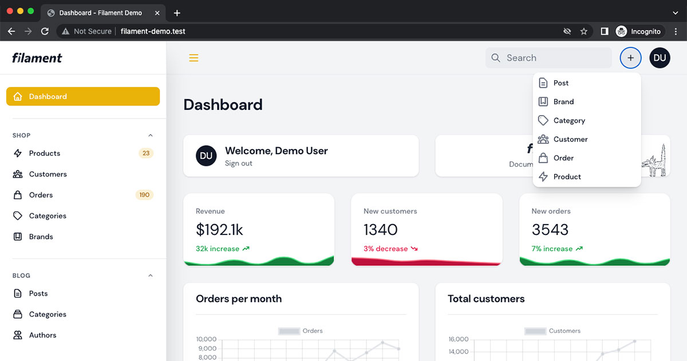

# Filament Quick Create

Plugin for Filament Admin that adds a dropdown menu to the header to quickly create new items from any page.




## Installation

Install the package via composer

```bash
composer require awcodes/filament-quick-create
```

## Excluding Resources

Publish the config file.

```bash
php artisan vendor:publish tag=filament-quick-create-config
```

Then just add the Resource Classes that you want to exclude.

```php
'exclude' => [
    UserResource::class,
    ...
]
```

## Usage

That's it, after installing the create menu will show up in the filament header next to the global search input.
